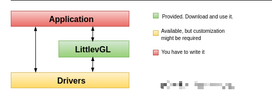

# 简介

## LVGL 简介
LVGL(Light and Versatile Graphics Library，轻巧而多功能的图形库)是一个免费的开放源代码图形库，它提供创建具有易于使用的图形元素，精美的视觉效果和低内存占用的嵌入式GUI所需的一切。

## LVGL 系统框架

应用程序创建 GUI 并处理特定任务的应用程序

LVGL 本身是一个图形库。我们的应用程序通过调用 LVGL 库来创建 GUI 。它包含一个 HAL （硬件抽象层）接口，用于注册显示和输入设备驱动程序。

驱动程序除特定的驱动程序外，它还有其他的功能，可驱动显示器到 GPU (可选)、读取触摸板或按钮的输入。

根据 MCU ，有两种典型的硬件设置。 一个带有内置 LCD/TFT 驱动器的外围设备，而另一种是没有内置 LCD/TFT 驱动器的外围设备。 在这两种情况下，都需要一个 帧缓冲区 来存储屏幕的当前图像。

1. 集成了 TFT/LCD 驱动器的 MCU 如果 MCU 集成了 TFT/LCD 驱动器外围设备，则可以直接通过RGB接口连接显示器。 在这种情况下，帧缓冲区可以位于内部 RAM（如果MCU有足够的RAM）中，也可以位于外部RAM（如果MCU具有存储器接口）中。
2. 如果 MCU 没有集成 TFT/LCD 驱动程序接口，则必须使用外部显示控制器(例如 SSD1963、SSD1306、ILI9341 )。 在这种情况下，MCU 可以通过并行端口，SPI 或通过 I2C 与显示控制器进行通信。 帧缓冲区通常位于显示控制器中，从而为 MCU 节省了大量 RAM 

